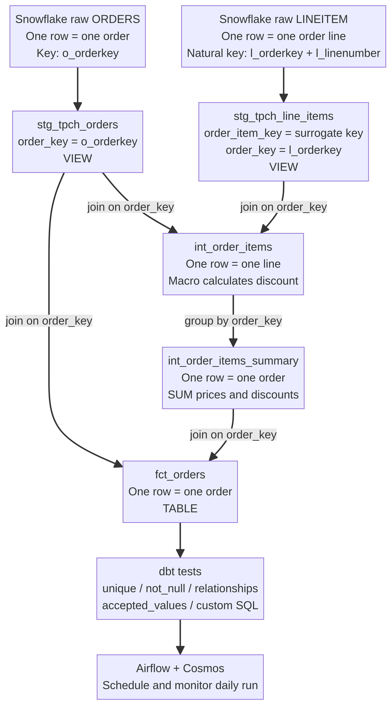

# ✍️ Build an ELT Pipeline in 1 Hour
## dbt + Snowflake + Airflow — handwritten-style notes for a complete beginner

> **The big idea:** We put messy data into a safe warehouse first, clean it with dbt, and let Airflow press the “run every day” button.

These notes follow the supplied tutorial, **“Code along - build an ELT Pipeline in 1 Hour (dbt, Snowflake, Airflow)”** [1]. The code below is written in a teaching style, so small names and comments are added to make the ideas easier to understand.

---

## 1. First, what problem are we solving?

Imagine a toy shop. Every day, the shop receives boxes containing orders and order lines. The boxes are messy: names are hard to understand, numbers have strange names, and it is difficult to answer questions such as:

> “How much money did each order make?”

A data pipeline is the set of steps that takes the messy boxes and makes a clean report.

### ETL versus ELT

| Name | Meaning | Simple picture |
|---|---|---|
| **ETL** | Extract → Transform → Load | Clean the toys before putting them in the toy room |
| **ELT** | Extract → Load → Transform | Put the boxes in the warehouse first, then clean them there |

This tutorial uses **ELT**. Snowflake is the big warehouse. The raw TPC-H sample data is loaded there first. dbt then writes SQL that cleans and combines the data inside Snowflake. Snowflake provides TPC-H sample data in the shared `SNOWFLAKE_SAMPLE_DATA` database, including the `TPCH_SF1` schema [5].

### The three helpers

| Tool | Job | Five-year-old explanation |
|---|---|---|
| **Snowflake** | Stores and runs SQL on the data | The large, powerful warehouse |
| **dbt** | Organizes SQL models, dependencies, tests, and documentation | The recipe book for cleaning the boxes |
| **Airflow** | Starts the work on a schedule and shows task status | The alarm clock that says “start cleaning now!” |

The tutorial uses **Astronomer Cosmos** to let Airflow understand and run a dbt project [1].

---

## 2. The story of the data

The tutorial uses two TPC-H tables:

- `ORDERS`: one row describes one customer order.
- `LINEITEM`: one row describes one product line inside an order.

One order may have many line items. For example:

```text
Order 100
├── Line 1: pencil
├── Line 2: notebook
└── Line 3: eraser
```

That means the relationship is:

```text
one order  ───────────────<  many order lines
```

The small sign `<` means “many.” The order is the parent, and the line items are the children.

---

## 3. The dbt project is like a tidy kitchen

A dbt project contains folders. Each folder has a special job.

```text
data_pipeline/
├── dbt_project.yml          ← project rulebook
├── packages.yml              ← extra helper recipes
├── macros/                   ← reusable SQL recipes
│   └── pricing.sql
├── models/                   ← SQL models that become warehouse objects
│   ├── staging/              ← gentle cleaning of raw tables
│   │   ├── tpch_sources.yml
│   │   ├── stg_tpch_orders.sql
│   │   └── stg_tpch_line_items.sql
│   └── marts/                ← useful business tables
│       ├── int_order_items.sql
│       ├── int_order_items_summary.sql
│       ├── fct_orders.sql
│       └── generic_tests.yml
└── tests/                    ← special business-rule checks
    ├── fct_orders_discount.sql
    └── fct_orders_date_valid.sql
```

The usual data journey is:

```text
raw source data
      ↓
staging: rename and lightly clean
      ↓
intermediate: join and calculate
      ↓
marts: make business-friendly tables
      ↓
tests: check that the answers are sensible
```



*Visual map: the left-to-right meaning of the keys is more important than memorizing the box names.*

The official dbt project-structure guidance describes this movement as going from **source-conformed** data toward **business-conformed** data. It recommends thinking in layers: staging, intermediate, and marts [4].

---

## 4. Snowflake setup: build the empty rooms first

The tutorial creates a small Snowflake environment:

```sql
use role accountadmin;

create warehouse dbt_wh with warehouse_size = 'x-small';
create database dbt_db;
create role dbt_role;

grant usage on warehouse dbt_wh to role dbt_role;
grant role dbt_role to user <your_username>;
grant all on database dbt_db to role dbt_role;

use role dbt_role;
create schema dbt_db.dbt_schema;
```

Think of the objects this way:

| Snowflake object | Child-friendly meaning |
|---|---|
| Warehouse `dbt_wh` | The engine that does the work |
| Database `dbt_db` | The building where data lives |
| Schema `dbt_schema` | A room inside the building |
| Role `dbt_role` | A permission badge |

The role must have permission to use the warehouse and database. Otherwise, dbt may know the recipe but be unable to cook it.

The tutorial then initializes dbt with `dbt init`, selecting Snowflake and entering the account, username, password, role, warehouse, database, schema, and thread count. The exact values depend on your own Snowflake account [1].

> **Safety note:** Never put a real password in a public code file. Use a secure profile, environment variable, or secrets manager.

---

## 5. `dbt_project.yml`: the rulebook

The tutorial configures staging models as views and marts as tables:

```yaml
models:
  data_pipeline:
    staging:
      +materialized: view
      snowflake_warehouse: dbt_wh
    marts:
      +materialized: table
      snowflake_warehouse: dbt_wh
```

### What is a materialization?

A **materialization** tells dbt what kind of Snowflake object to create from a model. dbt supports materializations such as `view`, `table`, `incremental`, `ephemeral`, and `materialized_view` [3].

| Layer | Tutorial choice | Why it makes sense |
|---|---|---|
| Staging | `view` | Staging mostly renames columns, so we avoid making extra copies |
| Mart | `table` | The final report should be quick for people and dashboards to query |

A view is like a window: it shows the latest data when someone looks through it. A table is like a prepared box: it stores the result so people can open it quickly. dbt’s documentation describes views as useful for lighter transformations and tables as useful for fast querying [3].

---

## 6. Sources: telling dbt where the raw boxes are

The file `models/staging/tpch_sources.yml` tells dbt that the raw data is in Snowflake:

```yaml
version: 2

sources:
  - name: tpch
    database: snowflake_sample_data
    schema: tpch_sf1
    tables:
      - name: orders
        columns:
          - name: o_orderkey
            tests:
              - unique
              - not_null

      - name: lineitem
        columns:
          - name: l_orderkey
            tests:
              - relationships:
                  to: source('tpch', 'orders')
                  field: o_orderkey
```

A source is the address label on a raw box. The official dbt documentation says that declaring sources lets dbt select from the source, create lineage, test assumptions, and optionally check freshness [2].

In a SQL model, we use:

```sql
{{ source('tpch', 'orders') }}
```

This is not the final SQL that Snowflake sees. dbt changes it into a real, fully qualified table name, conceptually like:

```sql
snowflake_sample_data.tpch_sf1.orders
```

> **Remember:** `source()` means “go to a raw table that came from outside dbt.”

---

# 7. Staging models: give the raw columns friendly names

## What does “staging” mean?

Staging is the first gentle cleaning stop. It is not the final report. It is like taking toys out of a messy box and putting labels on them.

A staging model usually has a nearly **one-to-one relationship** with its source table: one source row becomes one staging row. The tutorial uses staging to rename columns into easier names.

---

## 7A. `stg_tpch_orders.sql`

```sql
select
    o_orderkey   as order_key,
    o_custkey    as customer_key,
    o_orderstatus as status_code,
    o_totalprice as total_price,
    o_orderdate  as order_date
from {{ source('tpch', 'orders') }}
```

The raw column `o_orderkey` becomes `order_key`. The value is not changed; only its name is made friendlier.

| Raw column | Staging column | Meaning |
|---|---|---|
| `o_orderkey` | `order_key` | Which order is this? |
| `o_custkey` | `customer_key` | Which customer made it? |
| `o_orderstatus` | `status_code` | What is the order’s status? |
| `o_totalprice` | `total_price` | Source-provided total price |
| `o_orderdate` | `order_date` | When was the order placed? |

The model uses `source()` because `orders` is a raw Snowflake table, not another dbt model.

---

## 7B. `stg_tpch_line_items.sql`

```sql
select
    {{ dbt_utils.generate_surrogate_key([
        'l_orderkey',
        'l_linenumber'
    ]) }} as order_item_key,

    l_orderkey     as order_key,
    l_partkey      as part_key,
    l_linenumber   as line_number,
    l_quantity     as quantity,
    l_extendedprice as extended_price,
    l_discount     as discount_percentage,
    l_tax          as tax_rate
from {{ source('tpch', 'lineitem') }}
```

This model does two important things:

1. It renames the raw columns.
2. It creates a new unique identifier for each order line.

The second point is the key lesson, so let us slow down.

---

# 8. SQL keys explained like a five-year-old

A **key** is a label that helps us find the right row.

Imagine every child at school has a name. If two children have the same name, the name alone is not enough. We may need the child’s name plus their classroom number. In databases, we use the same idea.

## 8A. Natural key

A **natural key** is an identifier already present in the source data.

For the `ORDERS` table, `o_orderkey` identifies the order. After renaming, it becomes:

```text
order_key = o_orderkey
```

The order key is the natural key because it came from the source system.

## 8B. Composite key

A **composite key** uses more than one column together.

A line item is identified by:

```text
l_orderkey + l_linenumber
```

Why? Because line number `1` can appear in many different orders:

| `l_orderkey` | `l_linenumber` | Is it unique by itself? |
|---:|---:|---|
| 100 | 1 | No |
| 101 | 1 | No |
| 100 | 2 | No |

But the pair is unique:

```text
(100, 1) ≠ (101, 1)
```

So the natural identity of one line is the pair:

```text
(order number, line number)
```

## 8C. Surrogate key

A **surrogate key** is a new technical key made from one or more columns. It does not try to be a human-friendly business fact. It simply gives each row one stable label.

The tutorial uses the `dbt_utils` package:

```yaml
packages:
  - package: dbt-labs/dbt_utils
    version: 1.1.1
```

After `dbt deps`, the project can call:

```sql
{{ dbt_utils.generate_surrogate_key([
    'l_orderkey',
    'l_linenumber'
]) }}
```

Conceptually, dbt-utils combines the two input values and creates a deterministic hash-like identifier:

```text
order 100 + line 1  →  key A
order 100 + line 2  →  key B
order 101 + line 1  →  key C
```

The exact hash text is not important for learning the pipeline. The important promise is:

> The same input pair should create the same line key, and different input pairs should normally create different line keys.

The tutorial names this generated key `order_item_key`.

## 8D. Foreign-key-like column

The line item keeps another column:

```text
l_orderkey as order_key
```

This is not redundant by accident. It remembers the parent order.

```text
stg_tpch_orders.order_key
              ↑
              │ parent order
              │
stg_tpch_line_items.order_key
```

In ordinary database language, the line’s `order_key` behaves like a **foreign key** pointing to the order’s `order_key`.

The `order_item_key` answers:

> “Which exact line is this?”

The `order_key` answers:

> “Which order owns this line?”

These are different questions, so we keep both keys.

---

# 9. How to determine SQL keys yourself

Do not guess keys from column names. Use the meaning of a row.

### The key-finding recipe

| Question | Example answer |
|---|---|
| What does one row represent? | One order line |
| Which source columns identify that thing? | `l_orderkey` and `l_linenumber` |
| Is one column enough? | No |
| Can we keep the pair as the key? | Yes, but a single technical key may be easier |
| Should we generate a surrogate key? | Yes, for a stable one-column line identifier |
| Does the row belong to a parent? | Yes, the line belongs to an order |
| Which column points to the parent? | `order_key` |
| What tests prove our assumptions? | `unique`, `not_null`, and `relationships` |

A useful rule is:

```text
first decide the grain → then choose the key → then choose the joins → then write tests
```

### Grain means “what is one row?”

| Model | Grain |
|---|---|
| `stg_tpch_orders` | One row per order |
| `stg_tpch_line_items` | One row per order line |
| `int_order_items` | One row per order line, with order details added |
| `int_order_items_summary` | One row per order after adding up its lines |
| `fct_orders` | One row per order |

Most SQL mistakes happen when we join or group tables without knowing their grain.

---

# 10. `ref()`: the dbt map between models

When a model uses another **dbt model**, it uses `ref()`:

```sql
{{ ref('stg_tpch_orders') }}
```

The official dbt documentation explains that `ref()` returns a relation, creates a dependency in the dbt graph, and compiles to the full database object name [6].

Think of `ref()` as saying:

> “Please use the model named `stg_tpch_orders`, and please build that model first.”

This is safer than writing a hardcoded warehouse address everywhere.

```text
source('tpch', 'orders')
        ↓
stg_tpch_orders
        ↓
ref('stg_tpch_orders')
        ↓
int_order_items
        ↓
ref('int_order_items')
        ↓
int_order_items_summary
```

`source()` points to raw external data. `ref()` points to another dbt-built object.

---

# 11. Macros: reusable SQL recipes

## What is a macro?

A macro is like a little recipe or function that can be reused. Instead of writing the same calculation many times, we write it once and call its name.

The official dbt documentation describes macros as reusable pieces of code, similar to functions in programming languages. dbt uses Jinja to mix programming-like templates with SQL [7].

The tutorial creates `macros/pricing.sql`:

```sql

    (-1 * {{ extended_price }} * {{ discount_percentage }})::decimal(16, {{ scale }})

```

### Read the macro line by line

| Part | Meaning |
|---|---|
| `` | Start a reusable recipe named `discounted_amount` |
| `extended_price` | First input ingredient |
| `discount_percentage` | Second input ingredient |
| `scale=2` | Optional default: keep two decimal places |
| `{{ extended_price }}` | Put the first input into the SQL text |
| `{{ discount_percentage }}` | Put the second input into the SQL text |
| `::decimal(16, 2)` | Convert the answer to a decimal number |
| `` | Finish the recipe |

The macro itself is **not a table**. It is a template. dbt expands it into SQL before Snowflake runs the model. dbt’s documentation shows this same idea: Jinja is compiled into ordinary SQL, and `dbt compile` can be used to inspect the compiled result [7].

### Calling the macro

Inside a model, the tutorial calls it like this:

```sql
{{ discounted_amount(
    'line_item.extended_price',
    'line_item.discount_percentage'
) }} as item_discount_amount
```

Conceptually, dbt turns that call into:

```sql
(
  -1 * line_item.extended_price * line_item.discount_percentage
)::decimal(16, 2) as item_discount_amount
```

If the extended price is `100` and the discount is `0.10`:

```text
-1 × 100 × 0.10 = -10.00
```

The negative sign means “discount reduces the amount.” A discount of `-10.00` is easier to add to sales than a positive discount, depending on the reporting design.

> **Tiny warning:** A macro only expands text. It does not magically know if the formula is correct. The test later checks that discounts are not positive.

---

# 12. Intermediate model: join line items to orders

The tutorial creates `int_order_items.sql`:

```sql
select
    line_item.order_item_key,
    line_item.part_key,
    line_item.line_number,
    line_item.extended_price,
    orders.order_key,
    orders.customer_key,
    orders.order_date,
    {{ discounted_amount(
        'line_item.extended_price',
        'line_item.discount_percentage'
    ) }} as item_discount_amount
from {{ ref('stg_tpch_orders') }} as orders
join {{ ref('stg_tpch_line_items') }} as line_item
    on orders.order_key = line_item.order_key
order by orders.order_date
```

### Why is the join on `order_key`?

Because the line must find its parent order.

```text
line_item.order_key = orders.order_key
```

We do **not** join on `order_item_key` because `orders` does not have an order-line key. The orders table is at order grain; the line-items table is at line grain.

The output remains one row per order line, but now each line has useful order information:

```text
line key + order key + customer key + order date + price + discount
```

This is called enriching the line item with its parent’s information.

---

# 13. Intermediate summary: many lines become one order

The next model is `int_order_items_summary.sql`:

```sql
select
    order_key,
    sum(extended_price) as gross_item_sales_amount,
    sum(item_discount_amount) as item_discount_amount
from {{ ref('int_order_items') }}
group by order_key
```

This changes the grain.

Before the `group by`:

```text
one row = one order line
```

After the `group by order_key`:

```text
one row = one order
```

Suppose Order 100 has three lines:

| `order_key` | `extended_price` | `item_discount_amount` |
|---:|---:|---:|
| 100 | 20.00 | -2.00 |
| 100 | 30.00 | -3.00 |
| 100 | 50.00 | -5.00 |

The summary becomes:

| `order_key` | `gross_item_sales_amount` | `item_discount_amount` |
|---:|---:|---:|
| 100 | 100.00 | -10.00 |

The key used in the `group by` is `order_key` because the desired result is one summary row per order.

> **Most important grouping rule:** Every selected column that is not inside an aggregate such as `sum()` must be in the `group by`.

---

# 14. Final mart: `fct_orders`

The tutorial builds the final table:

```sql
select
    orders.*,
    order_item_summary.gross_item_sales_amount,
    order_item_summary.item_discount_amount
from {{ ref('stg_tpch_orders') }} as orders
join {{ ref('int_order_items_summary') }} as order_item_summary
    on orders.order_key = order_item_summary.order_key
order by order_date
```

This join is safe because both sides are now at order grain:

```text
stg_tpch_orders:          one row per order
int_order_items_summary:  one row per order
```

The final result is:

```text
one order row + its calculated line-item totals
```

That is why this model is a good mart or fact table. It is shaped for business questions rather than for the raw source system.

### Why is it called `fct_orders`?

“`fct`” means **fact**. A fact table usually contains measurable business activity, such as sales amount, quantity, discount, or tax. In this tutorial, `fct_orders` contains order-level information plus calculated money measures.

| Column group | Examples | Role |
|---|---|---|
| Identifier | `order_key` | Names the order row |
| Descriptive fields | `customer_key`, `status_code`, `order_date` | Tell us about the order |
| Measures | `gross_item_sales_amount`, `item_discount_amount` | Numbers we can add or analyze |

---

# 15. Tests: the pipeline’s safety net

A test is a question about the data.

Examples:

```text
Is every order key present?
Is every order key unique?
Are status values only P, O, or F?
Does every child order key point to a real order?
Are discount amounts never positive?
Are dates in a reasonable range?
```

## 15A. Generic tests

The tutorial adds tests in YAML:

```yaml
models:
  - name: fct_orders
    columns:
      - name: order_key
        tests:
          - unique
          - not_null
          - relationships:
              to: ref('stg_tpch_orders')
              field: order_key
              severity: warn

      - name: status_code
        tests:
          - accepted_values:
              values: ['P', 'O', 'F']
```

These are reusable, built-in test recipes:

| Test | Child-friendly question |
|---|---|
| `unique` | Does every row have a different key? |
| `not_null` | Is the key never blank? |
| `relationships` | Does this key point to a real parent row? |
| `accepted_values` | Is the value from the approved list? |

The current dbt documentation explains that generic tests are parameterized and reusable, while singular tests are custom SQL checks [8]. Depending on the dbt version, YAML syntax may appear as `tests:` or the newer `data_tests:` spelling; follow the syntax supported by the version used in the project.

## 15B. Singular tests

A singular test is a custom SQL file. The most important rule is:

> A dbt data test passes when its query returns **zero failing rows** [8].

That sounds backwards at first. We do not write a query that returns the good rows. We write a query that hunts for bad rows.

### Discount test

```sql
select *
from {{ ref('fct_orders') }}
where item_discount_amount > 0
```

This means:

```text
“Show me every order whose discount is positive.”
```

If the query returns zero rows, no bad discounts were found, so the test passes.

The video initially demonstrates the opposite condition, `< 0`, which returns many rows because discounts are intentionally negative. That fails because the query is finding records. Changing it to `> 0` correctly searches for the unwanted situation [1].

### Date test

```sql
select *
from {{ ref('fct_orders') }}
where date(order_date) > current_date()
   or date(order_date) < date('1990-01-01')
```

This asks:

```text
“Show me orders dated in the future or before 1990.”
```

Again, zero rows means the test passes.

---

# 16. The entire key and join story in one picture

```text
RAW ORDERS
  o_orderkey
      │ rename
      ▼
STG ORDERS
  order_key  ← one order identifier
      │
      │ join on order_key
      │
RAW LINEITEM
  l_orderkey + l_linenumber
      │ rename + generate surrogate key
      ▼
STG LINE ITEMS
  order_item_key  ← exact line identifier
  order_key       ← parent order identifier
      │
      ▼
INT ORDER ITEMS
  one row per line, with order details
      │ group by order_key
      ▼
INT ORDER ITEMS SUMMARY
  one row per order
      │ join on order_key
      ▼
FCT ORDERS
  one row per order + money measures
```

### The key map

| Object | One row means | Main identifier | Join/group key |
|---|---|---|---|
| Raw `orders` | One order | `o_orderkey` | `o_orderkey` |
| Raw `lineitem` | One line in an order | `l_orderkey + l_linenumber` | `l_orderkey` to parent order |
| `stg_tpch_orders` | One order | `order_key` | `order_key` |
| `stg_tpch_line_items` | One line | `order_item_key` | `order_key` to orders |
| `int_order_items` | One enriched line | `order_item_key` | `order_key` |
| `int_order_items_summary` | One order summary | `order_key` | `group by order_key` |
| `fct_orders` | One final order row | `order_key` | `order_key` |

---

# 17. Airflow: make the pipeline run every day

The tutorial creates an Astro/Airflow project and installs the pieces needed to run dbt with Snowflake:

```text
astronomer-cosmos
apache-airflow-providers-snowflake
dbt-snowflake
```

A Snowflake connection is created in Airflow with settings such as:

```text
Connection ID: snowflake_conn
Warehouse:     dbt_wh
Database:      dbt_db
Role:          dbt_role
Schema:        dbt_schema
```

Then the dbt project is copied into the Airflow `dags` folder, and a DAG is created with Cosmos. Conceptually, the DAG says:

```text
Every day:
  1. Open the dbt project.
  2. Look at source(), ref(), and model dependencies.
  3. Run staging first.
  4. Run intermediate models next.
  5. Run the final fact table.
  6. Run tests.
  7. Show success or failure in Airflow.
```

The important part is that Airflow does not replace dbt’s model logic. dbt still owns the SQL and dependency graph. Airflow owns scheduling, monitoring, and execution control.

---

# 18. What happens when you run the commands?

| Command | What it does |
|---|---|
| `dbt deps` | Downloads packages such as `dbt_utils` |
| `dbt compile` | Expands Jinja/macros and shows compiled SQL |
| `dbt run` | Builds the models in Snowflake |
| `dbt test` | Runs the data-quality checks |
| `astro dev start` | Starts the local Airflow environment |
| Airflow DAG trigger | Tells Cosmos to run the dbt project |

A simplified dependency order is:

```text
source(tpch.orders) ───────────────┐
                                   ├─> stg_tpch_orders ───────┐
source(tpch.lineitem) ────────────┘                           │
                                                             ├─> int_order_items
stg_tpch_orders ──────────────────────────────────────────────┘
stg_tpch_line_items ──────────────────────────────────────────┘

int_order_items ──> int_order_items_summary ──┐
stg_tpch_orders ──────────────────────────────┴─> fct_orders ──> tests
```

Because `source()` and `ref()` express dependencies, dbt can build the objects in the correct order instead of relying on a human to guess the order [2] [6].

---

# 19. One-minute memory card

```text
Snowflake = the warehouse.

ELT = load raw data first, transform later.

dbt model = a SQL file that becomes a warehouse object.

source() = point to raw data.

ref() = point to another dbt model and create a dependency.

staging = rename and lightly clean; usually one source row → one staging row.

macro = reusable SQL recipe; it expands before Snowflake runs the SQL.

marts = business-friendly tables made for analysis.

order_key = identifies an order.

order_item_key = identifies one exact line inside an order.

order_key in line items = points the line back to its parent order.

group by order_key = turn many lines into one order summary.

test = query that looks for bad rows; zero rows means success.

Airflow = schedules and monitors the dbt work.
```

---

# 20. Final beginner checklist

Before writing a model, say out loud what one row means. If you cannot say that sentence, you are not ready to choose the key.

Then identify the natural source key. If one column is not enough, use the composite key made of the necessary columns. If a stable one-column technical identifier is useful, create a surrogate key from the full set of identifying columns. Keep parent keys separately when a child row needs to join back to its parent.

Use staging models for simple cleanup, intermediate models for focused joins and calculations, and marts for tables that answer business questions. Use `source()` for raw warehouse tables and `ref()` for dbt models. Put repeated SQL formulas in a macro, but do not hide simple SQL behind a macro if that makes the model harder to read.

Finally, write tests that search for bad records. If the test finds zero bad records, the pipeline is happy.

---

## References

[1]: https://www.youtube.com/watch?v=OLXkGB7krGo "Code along - build an ELT Pipeline in 1 Hour (dbt, Snowflake, Airflow)"

[2]: https://docs.getdbt.com/docs/build/sources "Add sources to your DAG | dbt Developer Hub"

[3]: https://docs.getdbt.com/docs/build/materializations "Materializations | dbt Developer Hub"

[4]: https://docs.getdbt.com/best-practices/how-we-structure/1-guide-overview "How we structure our dbt projects | dbt Developer Hub"

[5]: https://docs.snowflake.com/en/user-guide/sample-data-tpch "Sample data: TPC-H | Snowflake Documentation"

[6]: https://docs.getdbt.com/reference/dbt-jinja-functions/ref "About ref function | dbt Developer Hub"

[7]: https://docs.getdbt.com/docs/build/jinja-macros "Jinja and macros | dbt Developer Hub"

[8]: https://docs.getdbt.com/docs/build/data-tests "Add data tests to your DAG | dbt Developer Hub"
